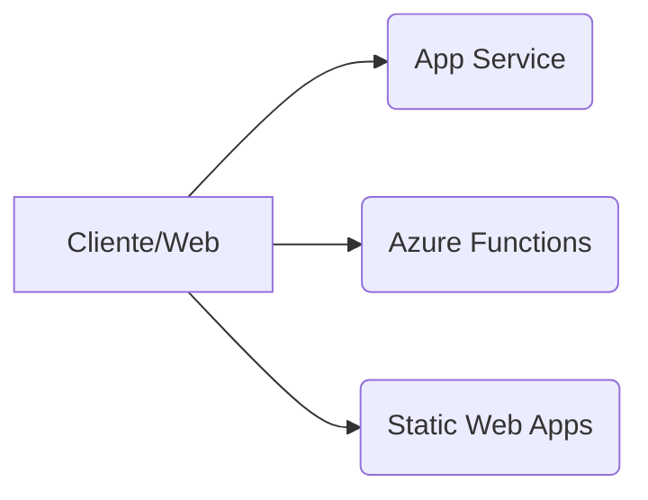

# Guía Completa de Azure CLI (10 Bloques Temáticos)

> Generado: 2025-11-11 14:27

Esta guía resume y ejemplifica los principales grupos de comandos de **Azure CLI** organizados en 10 bloques temáticos, con pasos y ejemplos prácticos.

---

## Índice
1. Autenticación y Configuración  
2. Gestión de Recursos y Grupos  
3. Servicios de Contenedores  
4. Redes y Seguridad  
5. Bases de Datos y Almacenamiento  
6. DevOps y Automatización  
7. Aplicaciones Web y Serverless  
8. Infraestructura y Máquinas Virtuales  
9. Automatización y Plantillas (ARM/Bicep)  
10. Monitoreo y Backup

---

## Bloque 1: Autenticación y Configuración

**Comandos:** `az login`, `az logout`, `az account`, `az configure`, `az config`

```bash
# Iniciar sesión (opcionalmente especificando el tenant)
az login --tenant <ID_TENANT>

# Listar suscripciones y establecer una por defecto
az account list --output table
az account set --subscription "<NOMBRE_O_ID>"

# Configuración interactiva y no interactiva
az configure
az config set core.output=table
```

---

## Bloque 2: Gestión de Recursos y Grupos

**Comandos:** `az group`, `az resource`, `az tag`, `az lock`

```bash
# Crear, listar y eliminar grupos de recursos
az group create --name MiGrupoRecursos --location eastus
az group list --output table
az group delete --name MiGrupoRecursos --yes

# Operaciones con recursos genéricos
az resource list --output table
az resource show --name MiRecurso --resource-group MiGrupoRecursos
az resource delete --name MiRecurso --resource-group MiGrupoRecursos

# Etiquetado
a z resource tag --tags Ambiente=Produccion --name MiRecurso --resource-group MiGrupoRecursos

# Bloqueos
az lock create --name BloqueoEliminar --lock-type CanNotDelete --resource-group MiGrupoRecursos   --resource-name MiRecurso --resource-type "Microsoft.Compute/virtualMachines"
az lock delete --name BloqueoEliminar --resource-group MiGrupoRecursos
```

---

## Bloque 3: Servicios de Contenedores

**Comandos:** `az acr`, `az aks`, `az container`, `az containerapp`

```bash
# ACR
az acr create --name MiRegistro --resource-group MiGrupoRecursos --sku Basic --location eastus
az acr login --name MiRegistro

# AKS
az aks create --resource-group MiGrupoRecursos --name MiClusterAKS --node-count 2   --enable-addons monitoring --generate-ssh-keys
az aks get-credentials --resource-group MiGrupoRecursos --name MiClusterAKS

# ACI
az container create --resource-group MiGrupoRecursos --name MiContenedor   --image nginx --cpu 1 --memory 1.5 --dns-name-label miappdemo --ports 80

# Container Apps
az containerapp env create --name MiEntorno --resource-group MiGrupoRecursos --location eastus
az containerapp create --name MiApp --resource-group MiGrupoRecursos --environment MiEntorno   --image nginx --target-port 80 --ingress external
```

---

## Bloque 4: Redes y Seguridad

**Comandos:** `az network`, `az keyvault`, `az role`, `az security`

```bash
# Red virtual + subred
az network vnet create --name MiVNet --resource-group MiGrupoRecursos   --address-prefix 10.0.0.0/16 --subnet-name MiSubred --subnet-prefix 10.0.1.0/24

# NSG y regla
az network nsg create --name MiNSG --resource-group MiGrupoRecursos
az network nsg rule create --resource-group MiGrupoRecursos --nsg-name MiNSG --name PermitirHTTP   --protocol Tcp --direction Inbound --priority 100 --source-address-prefixes '*'   --source-port-ranges '*' --destination-port-ranges 80 --access Allow

# Key Vault
az keyvault create --name MiKeyVault --resource-group MiGrupoRecursos --location eastus
az keyvault secret set --vault-name MiKeyVault --name MiSecreto --value "ValorSuperSeguro"

# RBAC
az role assignment create --assignee <ID_USUARIO> --role "Contributor"   --scope /subscriptions/<ID_SUBSCRIPCION>/resourceGroups/MiGrupoRecursos

# Defender for Cloud
az security alert list --output table
```

---

## Bloque 5: Bases de Datos y Almacenamiento

**Comandos:** `az storage`, `az sql`, `az cosmosdb`, `az mysql`, `az netappfiles`

```bash
# Storage
az storage account create --name MiStorage --resource-group MiGrupoRecursos --location eastus --sku Standard_LRS
az storage container create --name micontenedor --account-name MiStorage
az storage blob upload --account-name MiStorage --container-name micontenedor --name archivo.txt --file ./archivo.txt

# SQL
az sql server create --name MiServidorSQL --resource-group MiGrupoRecursos --location eastus   --admin-user adminsql --admin-password MiPassword123!
az sql db create --resource-group MiGrupoRecursos --server MiServidorSQL --name MiBaseDatos --service-objective S0

# Cosmos DB (API SQL)
az cosmosdb create --name MiCosmos --resource-group MiGrupoRecursos --kind GlobalDocumentDB   --locations regionName=eastus failoverPriority=0
az cosmosdb sql database create --account-name MiCosmos --resource-group MiGrupoRecursos --name MiBaseCosmos
az cosmosdb sql container create --account-name MiCosmos --database-name MiBaseCosmos --name MiContenedor   --partition-key-path "/id"

# MySQL
az mysql server create --name MiMySQL --resource-group MiGrupoRecursos --location eastus   --admin-user adminmysql --admin-password MiPassword123! --sku-name B_Gen5_1 --version 5.7

# NetApp Files
az netappfiles account create --resource-group MiGrupoRecursos --name MiNetApp --location eastus
```

---

## Bloque 6: DevOps y Automatización

**Comandos:** `az devops`, `az repos`, `az pipelines`, `az boards`, `az artifacts`

```bash
# DevOps
az devops configure --defaults organization=https://dev.azure.com/MiOrganizacion project=MiProyecto
az devops project list --output table

# Repos
a z repos create --name NuevoRepo

# Pipelines
az pipelines create --name MiPipeline --repository MiRepo --branch main --yml-path azure-pipelines.yml
az pipelines run --name MiPipeline

# Boards
az boards work-item create --title "Nueva tarea" --type Task --project MiProyecto

# Artifacts
az artifacts feed create --name MiFeed
```

---

## Bloque 7: Aplicaciones Web y Serverless

**Comandos:** `az appservice`, `az webapp`, `az functionapp`, `az staticwebapp`

```bash
# Plan de App Service
az appservice plan create --name MiPlanApp --resource-group MiGrupoRecursos --sku B1 --is-linux

# Web App
az webapp create --name MiWebApp --resource-group MiGrupoRecursos --plan MiPlanApp --runtime "PYTHON|3.9"

# Function App
az functionapp create --resource-group MiGrupoRecursos --consumption-plan-location eastus   --name MiFunctionApp --storage-account MiStorage --runtime python

# Static Web Apps
az staticwebapp create --name MiStaticApp --resource-group MiGrupoRecursos   --source https://github.com/usuario/repositorio --branch main --location eastus --app-location "/"
```

### Diagrama (Mermaid)



---

## Bloque 8: Infraestructura y Máquinas Virtuales

**Comandos:** `az vm`, `az vmss`, `az disk`, `az snapshot`, `az image`

```bash
# VM
az vm create --resource-group MiGrupoRecursos --name MiVM --image UbuntuLTS --admin-username azureuser --generate-ssh-keys

# VMSS
az vmss create --resource-group MiGrupoRecursos --name MiVMSS --image UbuntuLTS --upgrade-policy-mode automatic --instance-count 2
az vmss scale --resource-group MiGrupoRecursos --name MiVMSS --new-capacity 5

# Discos y snapshots
az disk create --resource-group MiGrupoRecursos --name MiDisco --size-gb 128 --sku Premium_LRS
az vm disk attach --resource-group MiGrupoRecursos --vm-name MiVM --name MiDisco
az snapshot create --resource-group MiGrupoRecursos --name MiSnapshot --source MiDisco --location eastus --sku Standard_LRS

# Imagen personalizada
az image create --resource-group MiGrupoRecursos --name MiImagen --source MiVM
```

---

## Bloque 9: Automatización y Plantillas (ARM/Bicep)

**Comandos:** `az deployment`, `az bicep`, `az deployment-scripts`, `az ts`

```bash
# Despliegue de plantilla ARM (grupo)
az deployment group create --resource-group MiGrupoRecursos --template-file plantilla.json   --parameters nombreVM=MiVM tamañoVM=Standard_DS1_v2

# Bicep
az bicep build --file plantilla.bicep
az deployment group create --resource-group MiGrupoRecursos --template-file plantilla.bicep   --parameters nombreVM=MiVM tamañoVM=Standard_DS1_v2

# Deployment Scripts
az deployment-scripts create --resource-group MiGrupoRecursos --name MiScript --location eastus   --script "echo Hola Azure"

# Template Specs
az ts create --name MiTemplateSpec --resource-group MiGrupoRecursos --location eastus --template-file plantilla.bicep
```

---

## Bloque 10: Monitoreo y Backup

**Comandos:** `az monitor`, `az backup`, `az consumption`

```bash
# Azure Monitor (métricas y alerta)
az monitor metrics list --resource /subscriptions/<ID_SUBSCRIPCION>/resourceGroups/MiGrupoRecursos/providers/Microsoft.Compute/virtualMachines/MiVM   --metric "Percentage CPU" --interval PT1H
az monitor metrics alert create --name AlertaCPU --resource-group MiGrupoRecursos   --scopes /subscriptions/<ID_SUBSCRIPCION>/resourceGroups/MiGrupoRecursos/providers/Microsoft.Compute/virtualMachines/MiVM   --condition "avg Percentage CPU > 80" --description "Alerta cuando CPU > 80%"

# Backup (Recovery Services Vault)
az backup vault create --name MiVaultBackup --resource-group MiGrupoRecursos --location eastus
az backup protection enable-for-vm --resource-group MiGrupoRecursos --vault-name MiVaultBackup --vm MiVM --policy-name DefaultPolicy
az backup protection backup-now --resource-group MiGrupoRecursos --vault-name MiVaultBackup   --container-name MiVM --item-name MiVM --retain-until 2025-12-31

# Consumo y costos
az consumption usage list --start-date 2025-11-01 --end-date 2025-11-10 --output table
```

---

### Notas útiles
- Usa `--output table` para lecturas rápidas, `--query` (JMESPath) para filtrar, y `--only-show-errors` para reducir ruido.
- Define variables de entorno para suscripción/tenant si trabajás con múltiples cuentas.
- Habilitá **Managed Identity** y **Key Vault** para eliminar secretos en texto plano.

---

**Fin de la guía.**
